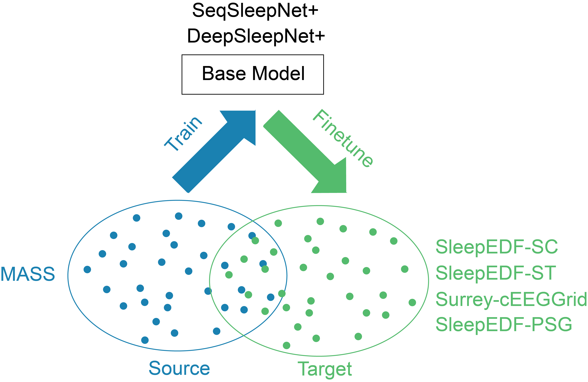
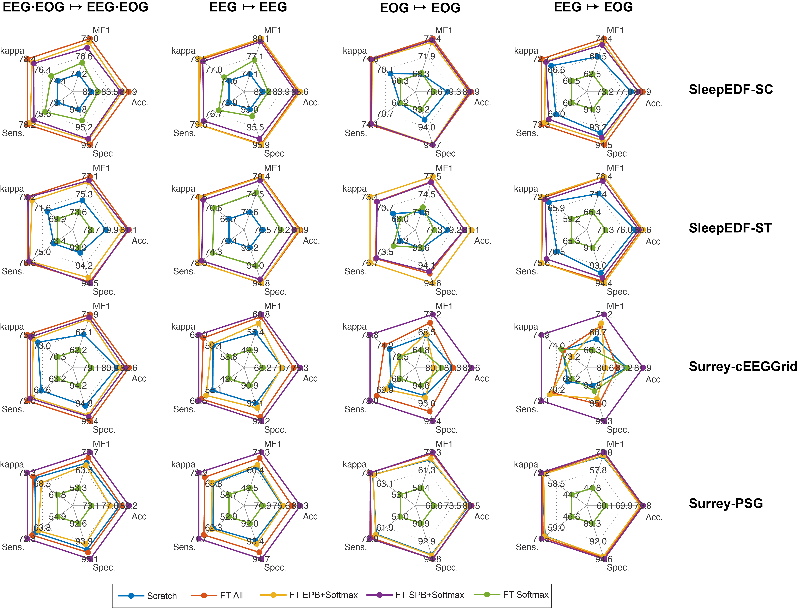
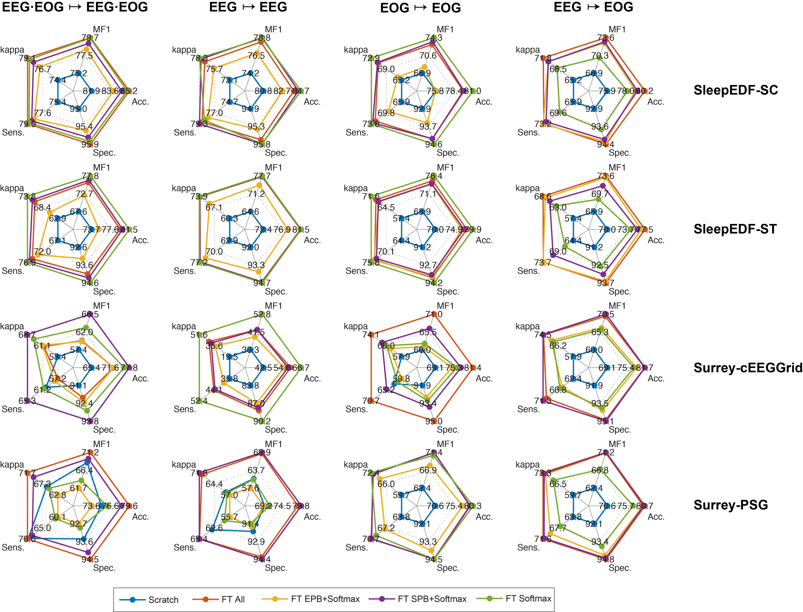

# Towards More Accurate Automatic Sleep Staging via Deep Transfer Learning

This repository contains source code, pretrained models, and experimental setup in the manuscript:

- Huy Phan, Oliver Y. Chén, Philipp Koch, Zongqing Lu, Ian McLoughlin, Alfred Mertins, and Maarten De Vos. [__Towards More Accurate Automatic Sleep Staging via Deep Transfer Learning.__](https://arxiv.org/abs/1907.13177) _arXiv preprint arXiv:1907.13177_, 2019

## Data Preparation with Matlab:
-------------

### SeqSleepNet
- Change path to `seqsleepnet/`
- Run `preprare_data_sleepedf_sc.m` to prepare SleepEDF-SC data (the path to the data must be provided, refer to the script for comments). The `.mat` files generated are stored in `mat/` directory.
- Run `genlist_sleepedf_sc.m` to generate list of SleepEDF-SC files for network training based on the data split in  `data_split_sleepedf_sc.mat`. The files generated are stored in `tf_data/` directory.
- Run `preprare_data_sleepedf_st.m` to prepare SleepEDF-ST data (the path to the data must be provided refer to the script for comments). The `.mat` files generated are stored in `mat/` directory.
- Run `genlist_sleepedf_st.m` to generate list of SleepEDF-ST files for network training based on the data split in  `data_split_sleepedf_st.mat`. The files generated are stored in `tf_data/` directory.

### DeepSleepNet (likewise)

## Network training and evaluation with Tensorflow:
-------------
### SeqSleepNet
- Change path to `seqsleepnet/tensorflow/seqsleepnet/`
- Run the example bash scripts:

	- `finetune_all.sh`: finetune entire a pretrained network
	- `finetune_softmax_SPB.sh`: finetune softmax + sequence processing block (SPB)
	- `finetune_softmax_EPB.sh`: finetune  softmax + epoch processing block (EPB)
	- `finetune_softmax.sh`: finetune softmax
	- `train_scratch.sh`: train a network from scratch

_Note_: when the `--pretrained_model` parameter is empty, the network will be trained from scratch. Otherwise, the specified pretrained model will be loaded and finetuned with the finetuning strategy specified in the `--finetune_mode` 
### DeepSleepNet (likewise)

_Note_: DeepSleepNet pretrained models are quite heavy. They were uploaded separately and can be downloaded from here: [https://zenodo.org/record/3375235](https://zenodo.org/record/3375235) 

## Evaluation
After training/finetuning and testing the network on test data:

- Change path to `seqsleepnet/` or `deepsleepnet/`
- Refer to `examples_evaluation.m` for examples that calculates the performance metrics.

## Some results:
-------------
- Finetuning results with _SeqSleepNet_:

- Finetuning results with _DeepSleepNet_:

## Environment:
-------------
- Matlab v7.3 (for data preparation)
- Python3
- Tensorflow GPU versions 1.4 - 1.14  (for network training and evaluation)
- numpy
- scipy
- sklearn
- h5py

## Note on the SleepEDF Expanded Database:

The SleepEDF expanded database can be download from https://physionet.org/content/sleep-edfx/1.0.0/. The latest version of this database contains 153 subjects in the SC subset. This experiment was conducted with the __previous version__ of the SC subset which contains __20 subjects__ intentionally to simulate the situation of a small cohort. If you download the new version, make sure to use 20 subjects __SC400-SC419__.

On the ST subset of the database, the experiments were conducted with 22 placebo recordings. Make sure that you refer to https://physionet.org/content/sleep-edfx/1.0.0/ST-subjects.xls to obtain the right recordings and subjects.

The experiments only used the __in-bed__ parts (from _light off_ time to _light on_ time) of the recordings to avoid the dominance of Wake stage  as suggested in 

- S. A. Imtiaz and E. Rodriguez-Villegas, __An open-source toolbox for standardized use of PhysioNet Sleep EDF Expanded Database__. _Proc. EMBC_, pp. 6014-6017, 2015.

Meta information (e.g. _light off_ and _light on_ times to extract the __in-bed__ parts data from the whole day-night recordings the meta information is provided in `sleepedfx_meta`.

## Contact:

Huy Phan  
Email: huy.phan{at}ieee.org or h.phan{a}kent.ac.uk  

## License

MIT © Huy Phan
